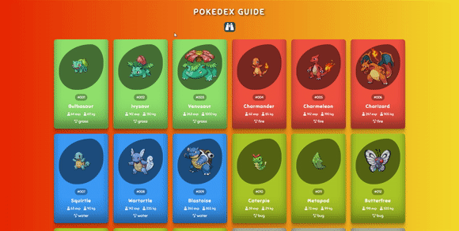

# Pokedex

I created a pokedex site. In the design, I implemented the dynamics with JavaScript along with CSS. 

As seen in the design, I got information about pokemons from https://pokeapi.co using the fetch method. 
Then, I designed the information coming from the API and the information such as the types and weights of the Pokemon separately.

<h2>Used Tech.</h2> 
<ul>
  <li>HTML was used.</li>
  <li>CSS was used in design.</li>
  <li>Javascript was used in dynamics.</li>
</ul>
<h2>Screen</h2>

